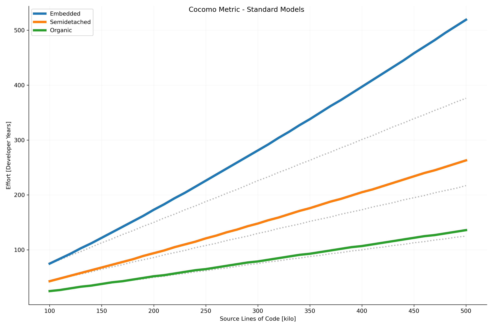

# Cocomoco


- E is the Effort in staff months
- a and b are coefficients to be determined
- KLOC is thousands of lines of code (*NOTE:* cocomoco uses LOC, do not enter kloc values)

With cocomoco, to calculate the effort for 100000 lines of code using the
*organic model*: `print(cocomoco.calculate(100000).effort)` -> 302.1 (person-months).

## Models

### Standard Models

Models define the coefficients a and b for typical projects.

- Organic
  - 2-50 KLOC
  - stable dev
  - little innovation
- Semidetached
  - 50-300 KLOC
  - average abilities
  - medium time-constraints
- Embedded
  - larger 300 KLOC
  - large project team
  - complex
  - innovative
  - severe constraints

#### Standard Constants

Organic:
- a: 2.4
- b: 1.05
Semidetached:
- a: 3.0
- b: 1.12
Embedded:
- a: 3.6
- b: 1.2

### Intermediate Models

Intermediate cocomo introduces cost drivers to the standard models.

- Product Attributes
  - **RELY** Required Software Reliability
  - **DATA** Data Base Size
  - **CPLX** Product Complexity
- Computer Attributes
  - **TIME** Execution Time Constraint
  - **STOR** Main Storage Constraint
  - **VIRT** Virtual Machine Volatility
  - **TURN** Computer Turnaround Time
- Personnel Attributes
  - **ACAP** Analyst Capability
  - **AEXP** Application Experience
  - **PCAP** Programming Capability
  - **VEXP** Virtual Machine Experience
  - **LEXP** Programming Language Experience
- Project Attributes
  - **MODP** Modern Programming Practices
  - **TOOL** Use of Software Tools
  - **SCED** Required Development Schedule

Cocomo commes with a predefined set of values in the following categories: very
low, low, nominal, high, very high, extra high. 

## Show Case

Following chart is created via `python3 -m cocomoco --demo-mode` (as well as other illustrations):




## Installation

Simple install this module via pip (pip for Python 2 is also supported)

```
pip3 install --user cocomoco
```

## Usage

### As Python Module

```
import cocomoco

result = cocomoco.calculate(100000)
print(result)
```

### As Python Executable

```sh
$ python3 -m cocomoco --sloc <number> [--model <modelname>]
```

# References

- Alan Caine, Constructive Cost Model COCOMO, https://cs.uwaterloo.ca/~apidduck/se362/Lectures/cocomo.pdf
